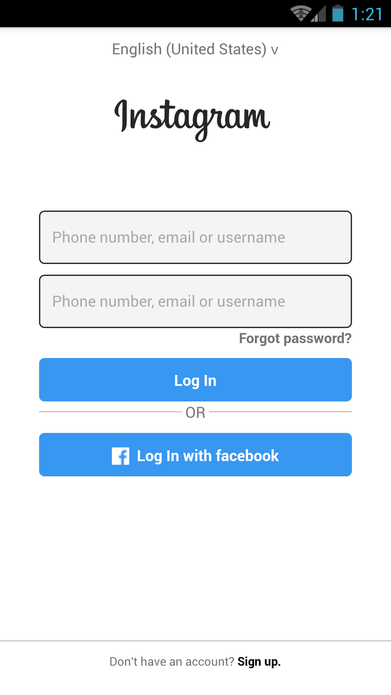

# instagram


## Before running
instagram login page (before running it)

## Install
```sh
$ npm i react-native-elements --save
```

```sh
$ npm i --save react-native-vector-icons
```

## Link
```sh
$ react-native link react-native-vector-icons
```

## Roadmap
I would be glad if someone wants to contribute. Keep a close eye on (https://github.com/ali-718).

## License
SMIU © [Ali Haider](https://www.facebook.com/Alihadrmydrugs78)
